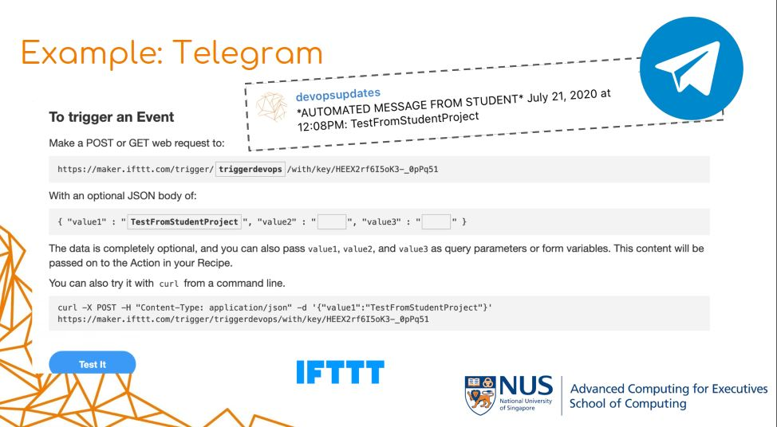
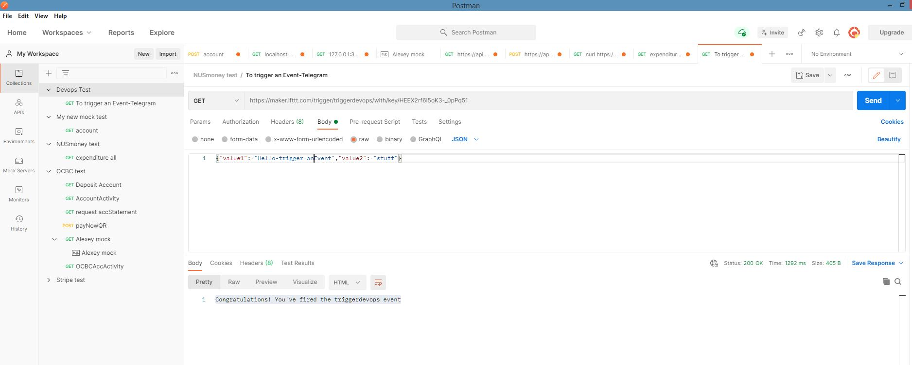
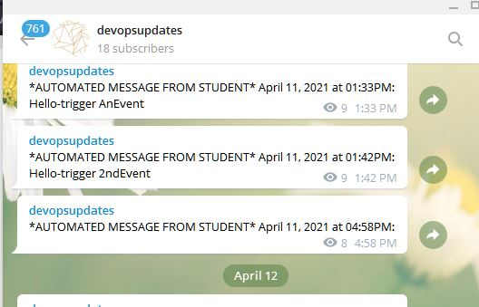

# DevOpsTest2
<h1> Example To trigger an Event in Telegram </h1>
to trigger an Event

<n2>Make a POST or GET web request to : </h2>

https://maker.ifttt.com/trigger/triggerdevops/with/key/HEEX2rf6I5oK3-_0pPq51

Use Postman to run the request
apply the link for GET request, click send button

Message : Congratulations! You've fired the triggerdevops event

<h2>With an optional Json body of : </h2>
{"value1": "Hello-trigger 2ndEvent","value2": "stuff"}

devopsupdates received the *automated message from student* Month dd,YYYY at hh:mm

Can also try it with curl from command line :
curl -X POST -H "Content-Type: application/json" -d '{"value1":"Stuffhappened","value2":"","value3":""}'
https://maker.ifttt.com/trigger/triggerdevops/with/key/HEEX2rf6I5oK3-_0pPq51

